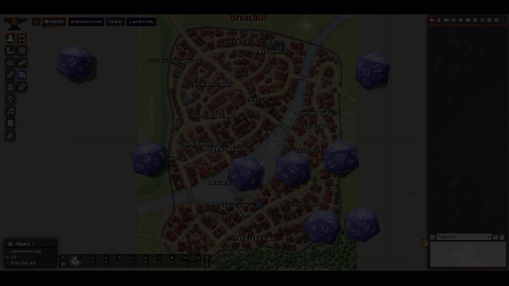

# Dramatic Rolls

A simple module for [FoundryVtt](https://foundryvtt.com/) that addes a little excitement to natural 20s and natural 1s.

## Usage Instructions
There are no particular instructions for use. Once the module is enabled, will automatically add sound effects to natural 20s or natural 1s, when a single d20 is being rolled. 

- Compatible with the [Dice So Nice!](https://foundryvtt.com/packages/dice-so-nice/) module. Holds the addition effects until the rolling animation is completed.

- Compatible with the [Confetti](https://foundryvtt.com/packages/confetti/) module. Triggers the confetti effect on natural 20s.

## Upcoming Features (Maybe)
- Adding visual effects that do not rely on the [Confetti](https://foundryvtt.com/packages/confetti/) module.
- Adding effects for min / max damage rolls.